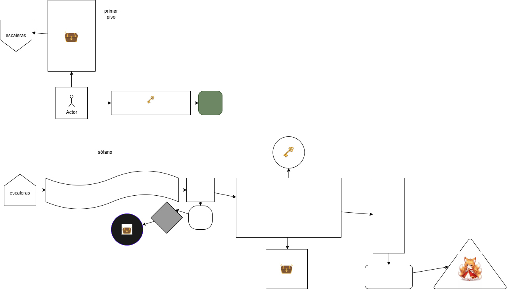

# CALABOZOS & ZORROS 🦊🏰


Bienvenido a **Calabozos & Zorros**, un juego de texto hecho en Python como proyecto de práctica.
El juego consiste en explorar una dungeon tomando decisiones para avanzar y descubrir qué sucede.

Es una experiencia corta (menos de 5 minutos) enfocada en la lógica, el flujo del juego y la narrativa.

## 🧩 Características
- Juego de texto basado en decisiones
- Exploración de una dungeon
- Sistema de llaves
- Enemigos y eventos
- Flujo narrativo con múltiples habitaciones
- No utiliza sistema de vida (decisión de diseño)

## 🗺️ Mapa de la dungeon


## ▶️ Cómo ejecutar el juego
1. Asegúrate de tener **Python 3** instalado
2. Descarga o clona este repositorio
3. Ejecuta el archivo principal desde la terminal:

```bash
python main.py
